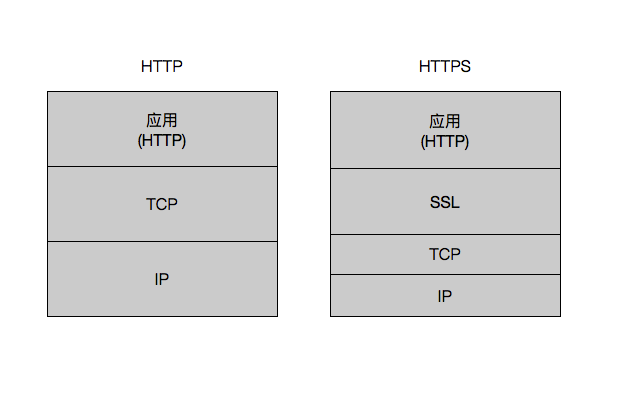
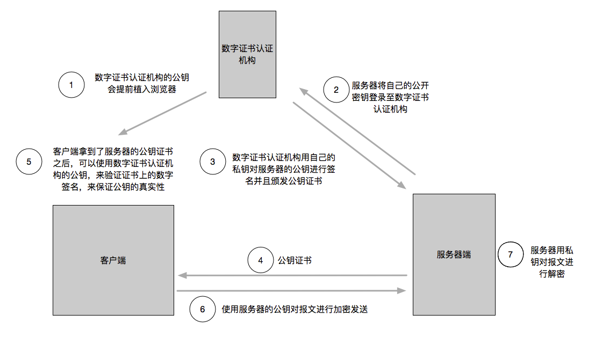
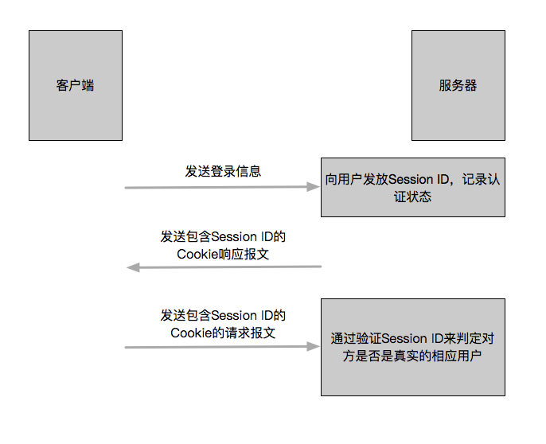

#Graphic HTTP

## 简介

### 基本概念
* URL:统一资源定位符，指定文档所在地址。
* TCP/IP协议族：
1. 应用层：决定了向用户提供应用服务时通信的活动。DNS/HTTP/FTP
2. 传输层：为应用层提供网络连接中两台计算机之间的数据传输。TCP/UDP
有连接/无连接，可靠/不可靠，较慢/较快，大量数据/少量数据
3. 网络层：处理网络上流动的数据包，数据包是网络传输的最小单位，该层规定了数据传输的路径。
4. 链路层：用来处理网络连接的硬件部分。
* 在进行数据传输的时候，需要在发送的时候进行从顶层到底层的封装，封装进去几层的首部。反之，对于接收端来说，需要在接收的时候自底向上进行封装的剥离，直到露出HTTP报文。

#### 和HTTP有关的协议族内容
##### IP
IP协议是为了将数据包传送给对方，通过对方的IP地址和MAC地址来进行确定对象的。在到达通信目标前的中转过程中，那些计算机和路由器等网络设备只能够获取很粗略的传输路线，这种行为称为路由选择routing。
在网络通信进行中转的时候，需要经过多台计算机或者网络设备，这里使用ARP协议用一个节点的IP地址来获取其MAC地址。
##### TCP
TCP位于传输层，用来提供可靠的字节流服务。也就是将报文分成数个截断的数据包，并且将确认这些数据包是否完整发送给对方。
为了让数据送达目标，TCP采用了三次握手，第一个发送包含SYN的数据包，接收完毕的时候服务端回复一个包含SYN/ACK标志的数据包，接收到确认信息的时候客户端会返回一个包含ACK标志的数据包，握手结束。
##### DNS
DNS服务也是应用层协议，主要用于域名的解析，将域名解析为IP地址。或者也可以反查，通过IP地址反查域名。
#### 协议族和HTTP的关系
1. 请求发起，使用域名到DNS服务器获取IP地址
2. 客户端TCP协议将HTTP报文截断为具有数字标志的一些TCP数据包
3. IP协议搜索通信对方的地址，并且将数据包传送给对方
4. 服务端TCP协议将数据包按照序号拼接成一个原本的HTTP报文
5. HTTP将收到的报文解析，根据报文内容进行响应，并且按照刚才的顺序对客户端进行响应。

### URL和URI
URL：统一资源定位符。
URL是web浏览器等访问的页面所输入的路径。
URI：统一资源标识符(Uniform Resource Identifier)
1. Uniform：规定统一的格式，可以方便处理多种类型的不同资源，并且便于新的协议方案添加。
2. Resource：资源的定义是“可标志的任何东西”
3. Identifier：表示可标识的对象，也成为标识符。

URI就是由某个协议方案标识的资源的定位标识符。协议方案是指访问资源所使用的协议类型名称。协议方案比如：http，ftp，file等。
URI用字符串标识某一个互联网资源，而URL表示资源的地点。也就是URI指定某一个特定的资源，而URL表示到哪里去找到这个资源。
如果需要表示指定的URI，就需要使用涵盖全部必要信息的绝对URI，绝对URL以及相对URL。
绝对URI包含这几个部分：
* 协议方案：比如http等。需要在后面添加一个冒号：`http:`
* 登录信息：指定用户名和密码来作为获取资源时候的登录信息
* 服务器地址：IPv4，IPv6或者域名。
* 服务器端口号：指定服务器连接的网络端口号。省略的话就是默认端口号。
* 带有层次的文件路径：指定服务器上的文件路径来定位特指的资源
* 查询字符串：针对指定的文件路径，可以用查询字符串传入参数
* 片段标识符：片段标识符标记处资源的一部分

## 简单的HTTP协议
### HTTP协议用于客户端和服务器端之间的通信
### HTTP是不保存状态的协议
HTTP不进行请求以及响应的状态保存，也就是HTTP对发送过的请求或者响应报文不进行持久化处理。并且采用了cookie来保存一些需要保存的状态，但是并不保存报文。

### 告知服务器意图的HTTP方法。
* GET：获取资源

GET方法用来请求被URI标识出来的资源。指定的资源被服务器端解析之后作为响应发送给客户端。

* POST：传输实体主体

POST用来让客户端传输某些信息给服务器端，这些信息被封装在请求报文的主体实体当中。

* PUT：传输文件

用来将文件包含在请求报文的主体中，然后将文件保存到请求URI所指定的位置上。

* HEAD：获取报文首部

HEAD方法和GET方法类似，不过不返回响应的主体。用来确认URI的有效性和资源的更新时间等信息。

* DELETE：删除文件

DELETE方法用来删除服务器上的某些文件，通过URI指定来进行确认删除的文件。

* OPTIONS：询问支持的方法

OPTIONS方法用来查询针对请求URI指定的资源所支持的方法。

* TRACE：追踪路径

TRACE方法让Web服务器端将请求的通信环回给客户端。在`Max-Forwards`首部字段上设置一个数值，每经过一次转发，这个数值就减1，数值减到0的时候就停止传输，最后接收到请求的服务器端返回状态码`200 OK`，返回的响应报文主体就是请求的报文，可以看到请求的报文是否被篡改。

* CONNECT：要求用隧道协议连接代理

CONNECT方法要求在与代理服务器通信时建立隧道，实现用隧道协议进行TCP通信。主要使用SSL和TLS协议来对通信内容进行加密，然后通过隧道传输。


#### 使用方法下达命令
向请求URI指定的资源发送请求报文，采用称为方法的命令。来指示资源按照方法的期望产生某种行为。
而HTTP/1.1新添加的方法是:OPTIONS,TRACE,CONNECT，而HTTP/1.0中的LINK和UNLINK方法已经被HTTP/1.1废弃。
### 持久连接节省通信量
HTTP协议的初始版本中，每次进行一次HTTP请求就需要断开一次TCP连接，所以需要进行一次三次握手和一次四次握手。而现代的web应用都需要进行许多次HTTP请求才能够获取一个页面加载所需要的全部内容，而每个请求都需要新建一个TCP连接，严重影响了通信效率。
#### 持久连接
为了解决不能够持久连接的问题，使用HTTP keep-alive方法可以在没有任何一端提出断开连接请求的情况下保持TCP连接的状态。
这样子减少了多次进行TCP连接和断开的操作，使客户端和服务端都得到了优化。HTTP/1.1默认所有连接都是持久化的，而HTTP/1.0不是这样的。
#### 管线化
持久连接使得多数请求以管线化的方式发送成为可能。管线化可以不用等待响应直接发送下一个请求。这样从一个服务器获取多个信息就可以并行执行，而不需要等待收到上一个请求的响应。
#### 使用cookie的状态管理
由于HTTP是无状态协议，而很多时候又需要保存客户端的状态，这就引入了cookie机制，cookie会从服务端的响应报文的`Set-Cookie`字段获取cookie并将cookie保存下来，下次客户端向服务端发送请求报文的时候会加入cookie的值再发送出去。

```
// 请求报文
GET /reader/ HTTP/1.1
Host: hacker.com

// 响应报文
HTTP/1.1 200 OK
Date: Thu, 12 Jul 2012 07:12:12 GMT
Server: Apache
<Set-Cookie: sid=123123123132; path=/; expires=Wed, 10-Oct-12 07:12:12 GMT>
Content-Type: text/plain; charset=UTF-8

// 含有Cookie的请求报文
GET /images/ HTTP/1.1
Host: hacker.com
Cookie: sid=123123123132
```

## HTTP报文
HTTP报文主要由报文首部和报文主体两个部分组成，用一个换行符进行分隔(CR+LF)。
* 请求行
包含用于请求的方法，请求URI以及HTTP协议版本号。
* 状态行
包含表明响应结果的状态码，原因短语以及HTTP协议版本号。
* 首部字段
包含表示请求和响应的各种条件和属性的各类首部。
首部一般有四种：通用首部，请求首部，响应首部和实体首部。
* 其他
可能包含HTTP的RFC里面未定义的首部(Cookie)。

### 编码提升传输速率
HTTP报文的主体用于传输请求或者响应的实体主体。
报文和实体的差异在于一个是报文的原文，另一个是报文在传输过程中的样子。
一般情况下报文主体等于实体主体，除非在传输的过程中采用了编码操作，会导致报文主体的内容发生了变化，使得实体主体和报文主体产生了差异。
#### 压缩传输的内容编码
HTTP协议中的内容编码可以对实体内容进行原样的编码压缩，内容编码后的实体由客户端接收并且负责解码。
常用的内容编码：
`gzip`,`compress`,`deflate`,`identity`。
#### 分割发送的分块传输编码
传输大容量数据的时候，可以将数据分割成多个块，能够让浏览器逐步显示页面。
这种将实体主体分块的功能称为分块传输编码。
每一个分块叫做一个*chunk*。每一个分块都会用十六进制来标记块的大小，而实体主体的最后一块会用0来进行标记。
客户端会对分块进行解码，恢复成原来的实体主体。

### 发送多种数据的多部分对象集合
HTTP采用了MIME机制，允许邮件处理文本、图片、视频等多个不同类型的数据。而在MIME的扩展中会使用一种称为多部分对象集合的方法，来容纳多份不同类型的数据。
相应地，HTTP协议中也采纳了多部分对象集合，发送的一份报文主体内可以含有多类型实体。
多部分对象集合包含的内容(multipart)：

* multipart/form-data

在Web表单上传的时候使用。
* multipart/byteranges
状态码206响应报文包含了多个范围的内容时使用。状态码206:表示部分请求成功，在请求的时候可以请求一个文件的几个部分，响应报文通过multipart来将请求的几个部分在一次HTTP响应报文中进行返回。

```
// multipart/form-data
Content-Type: multipart/form-data; boundary=AaB03x

--AaB03x
Content-Disposition: form-data; name="field1"

Joe Blow
--AaB03x
Content-Disposition: form-data; name="pics"; filename="file1.txt"
Content-Type: text-plain

...(file1.txt的相关内容)...
--AaB03x--

// multipart/byteranges
HTTP/1.1 206 Partial Content
Date: Fri, 13 Jul 2012 02:45:26 GMT
Last-Modified: Fri, 31 Aug 2007 02:02:20 GMT
Content-Type: multipart/byteranges; boundary=THIS_STRING_SEPARATES

--THIS_STRING_SEPARATES
Content-Type: application/pdf
Content-Range: bytes 500-999/8000

...数据...
--THIS_STRING_SEPARATES
Content-Type: application/pdf
Content-Range: bytes 7000-7999/8000

...数据...
--THIS_STRING_SEPARATES--
```

在HTTP报文中使用多部分对象集合的时候，需要在首部字段上加入`Content-Type`。
使用`boundary`字符串来划分多部分对象集合指明的各种类型的实体。在`boundary`字符串指定的各个实体的起始行之前插入`--`标记，并且在多部分对象集合对应的字符串之后插入`--`标记作为结束。
多部分对象集合的每个部分类型中，都可以含有首部字段。

### 获取部分内容的范围请求
在下载比较大的文件的时候，如果网络出现了中断，那就需要有断点续传功能，这时候需要进行指定文档的部分内容的获取。也叫做范围请求，可以只请求5001~10000字节内的资源。
执行范围请求的时候，会用到首部字段Range来指定资源的byte范围。
```
// 5001~10000字节
Range: bytes=5001-10000
// 5001字节之后的全部
Range: bytes=5001-
// 从一开始到3000字节和5000~7000字节的多重范围
Range: bytes=-3000, 5000-7000
```
针对范围请求，响应会返回状态码为`206 Partial Content`的响应报文。对于多重范围的范围请求，响应会在首部字段的`Content-Type`标明`multipart/byteranges`之后返回响应报文。

### 内容协商返回最合适的内容
同一个Web网站可能存在相同的页面，比如英文版或者中文版，如果需要按照客户端的方案获取其中之一，可以使用内容协商机制来进行完成。
内容协商机制主要是指客户端和服务端就响应的资源内容进行交涉，从而提供给客户端最为合适的资源。
请求报文的字段首部作为判断标准：
* Accept
* Accept-Charset
* Accept-Encoding
* Accept-Language
* Content-Language
三种驱动方式：
1. 客户端驱动方式：由用户自行手动选择或者通过脚本选择
2. 服务端驱动方式：用客户端发送的请求首部进行判断
3. 透明协商：两者结合的方法

## 返回结果的HTTP状态码
状态码的职责是当客户端向服务器端发送请求的时候，描述返回的请求结果。借助状态码，用户可以知道服务器端是否正常处理了请求。
* 1XX：信息性状态码，接收的请求正在处理
* 2XX：成功状态码，请求正常处理完毕
* 3XX：重定向状态码，需要进行附加操作以完成请求
* 4XX：客户端错误状态码，服务器无法处理请求
* 5XX：服务器错误状态码，服务器处理请求错误

### 2XX 成功
2XX的响应结果表明请求被正常处理了。
#### 200 OK
表示从客户端发过来的请求在服务器端被正常处理了。
在响应报文中，随着状态码一起返回的信息会因为方法不同而发生改变，比如：`HEAD`和`GET`方法的区别。
#### 204 No Content
该状态码代表服务器接收的请求已经成功，但是在返回的响应报文中不包含实体的主体部分。一般在只需要从客户端往服务器发送信息，而服务端不需要向客户端发送新信息内容的情况下使用。
#### 206 Partial Content
该状态码表示客户端进行了范围请求。而服务器成功执行了这部分的`GET`请求，响应报文中包含由`Content-Range`指定范围的实体内容。
### 3XX 重定向
3XX响应结果表明浏览器需要执行某些特殊的处理以正确处理请求。
#### 301 Moved Permanently
永久性重定向。该状态码表示请求的资源已经被分配了新的URI，以后应该使用资源现在对应的URI，并且应该按照`Location`首部字段提示的URI重新保存。
#### 302 Found
临时性重定向，该状态码表示请求的资源已经被分配了新的URI，希望用户能使用新的URI访问。
和`301 Moved Permanently`状态码相似，但是这个并不表示永久移动，仅仅是临时性质的。所以并不会更新书签。
#### 303 See Other
该状态码表示由于请求对应的资源存在着另外一个URI，应该使用`GET`方法定向获取请求的资源。这个状态码和302类似，唯一的区别是在重定向之后，会将请求方法强制转换为`GET`。
#### 304 Not Modified
该状态码表示客户端发送带条件的请求时，服务器端允许请求访问资源，但未满足条件的情况。`304`状态码返回时，不包含任何响应的主体部分。也就是表示请求的资源已经在客户端缓存当中了，并且客户端的缓存并没有过期
上述`GET`方法标志的条件：
* If-Match
* If-Modified-Since
* If-None-Match
* If-Range
* If-Unmodified-Since

#### 307 Temporary Redirect
临时重定向。该状态码与`302`具有相同的含义。`302`不允许`POST`转换为`GET`，但是实际之中可能不遵守，但是`307`会遵守协议的标准，而`303`会被完全转换为`GET`。
### 4XX客户端错误
4XX的响应结果表明客户端是发生错误的原因所在。
#### 400 Bad Request
该状态码表示请求报文中存在语法错误。当错误发生的时候，需要修改请求的内容后再次发送请求。
#### 401 Unauthorized
该状态码表示发送的请求需要通过HTTP认证，如果之前已经有过一次`401`，那么就代表之前那次的认证失败了。
返回含有`401`的响应需要包含一个`WWW-Authenticate`首部来质询用户信息。当浏览器初次收到这个响应，会弹出认证用的对话框。
#### 403 Forbidden
该状态码表示客户端对于资源的请求被服务器端拒绝了。服务器端可以不给出拒绝理由，或者将拒绝理由放在实体主体中进行描述。
未获得文件系统的访问权限或者权限发生了问题，是发生`403`的主要原因。
#### 404 Not Found
该状态码表示服务器上无法找到请求的资源。也可以用来拒绝请求，并且不想说明理由的时候使用。

### 5XX服务器错误
5XX的响应结果表示服务器本身发生了错误。
#### 500 Internal Server Error
服务器端执行请求发生错误，或者Web应用存在某些BUG。
#### 503 Service Unavailable
表示服务器暂时处于超负荷状态或者正在进行停机维护，现在无法处理请求。可以通过`Retry-After`首部来表示解除问题所需要的时间，来让客户端进行重试。

## 与HTTP协作的服务器
### 用单台虚拟主机实现多个域名
HTTP/1.1规范允许一台HTTP服务器搭建多个Web站点。客户端使用HTTP协议访问服务器的时候，使用域名进行访问，然后被DNS服务器映射为IP地址，但是如果一个服务器内部托管了两个域名，那么这两个域名映射出的IP是一样的。所以需要在`Host`首部指定域名。
### 通信数据转发程序：代理、网关、隧道
HTTP通信的时候，除了客户端和服务器之外，还有一些用于数据转发的应用程序。
#### 代理
代理服务器的基本行为就是接受客户端发来的请求，并且将这个请求原样转发给其他服务器，并不会改变URI。经过源服务器返回的响应信息也通过代理转发给客户端。在HTTP的通信中，可以级联多级代理服务器，转发的时候通过`Via`字段标记出经过的主机信息。
代理的主要作用有：缓存，访问控制，获取访问日志等。
* 缓存代理：代理转发响应的时候，缓存代理会将资源的副本保存在代理服务器上，当代理再次接受到对相同资源的请求时，就可以直接使用自己代理服务器上的缓存资源进行响应了。
* 透明代理：转发请求或者响应的时候，不对报文内容进行修改的代理称为透明代理。

#### 网关
网关的工作机制类似于代理，而网关可以将HTTP请求转换为非HTTP请求，让客户端获得非HTTP服务。网关还可以提高通信的安全性。
#### 隧道
隧道可以按照要求建立起一条与其他服务器的通信线路，可以使用SSL等加密手段来对通信信息进行加密，来保证客户端和服务器的安全通信。
隧道本身不解析HTTP请求，仅仅进行原样转发。并且在通信结束之后断开双方的连接。隧道本身对于客户端也是透明的。
### 保存资源的缓存
缓存代理在接收到服务器端给客户端的响应的时候，将服务端响应的资源保存在缓存代理内部，如果之后再有客户端请求相同的资源，那么就向服务器确认资源是否可用，如果可用的话，就直接将缓存的资源响应给客户端。
#### 缓存的有效期限
即使缓存服务器内有缓存，也不能保证每次请求的时候都有足够新的资源，因为资源也是存在有效性的。所以需要向服务器确认缓存的有效性。
#### 客户端的缓存
缓存还可以保存在客户端浏览器的缓存中。如果浏览器缓存有效，那么就不需要向服务器请求相同的资源了。和代理缓存一样，如果资源过期，那么就向服务器请求相同的资源。

## HTTP首部
### HTTP报文首部
HTTP协议的请求和响应报文中必定包含HTTP首部。首部的内容为客户端和服务器分别处理请求和响应提供所需要的必要信息。
* 请求报文：
请求中，HTTP报文由请求方法，HTTP协议版本，URI以及HTTP请求首部组成，可能也会有请求主体。
* 响应报文：
响应中，HTTP报文由状态码，状态短语，HTTP协议版本，以及HTTP响应首部组成。
在众多的报文字段当中，HTTP首部字段包含的信息最为丰富，首部字段同时存在于请求和响应报文当中，并且涵盖HTTP报文相关的内容信息。

### HTTP首部字段
#### HTTP首部字段传递重要的信息
在客户端以及服务器端之前的HTTP协议进行通信的过程中，能起到传递额外重要信息的作用。

#### HTTP首部字段的结构
HTTP首部字段是由首部字段名和字段值构成的，中间用冒号“：”分隔。比如使用`Content-Type`来表示报文主体的对象类型。
`Content-Type: text/html`
字段值对应的单个HTTP首部字段可以有多个值：
`Keep-Alive: timeout=15, max=100`
如果HTTP首部字段重复了的话，那么浏览器内部的处理可能不一样，有些浏览器会优先处理第一次出现的首部，有些则会处理最后出现的首部。

#### 4种HTTP首部字段的类型
* 通用首部字段
请求报文和响应报文两方都会使用的首部。
* 请求首部字段
客户端到服务器端专用的首部，补充了请求的附加内容、客户端信息等
* 响应首部字段
服务器端到客户端返回响应报文的时候使用的首部。补充了响应的附加内容
* 实体首部字段
针对请求和响应报文的实体部分使用的首部，补充了资源内容更新时间等与实体相关的信息。

#### 非HTTP/1.1首部字段
在HTTP协议通信交互中使用到的首部字段，也并不全是HTTP定义好的首部字段，还有`Cookie`,`Set-Cookie`和`Content-Disposition`等在其他RFC中定义的首部字段。

#### End-to-end首部和Hop-by-hop首部
HTTP首部字段将定义为缓存代理和非缓存代理，分成两种类型。
端到端首部：
该类别的首部会转发给请求/响应对应的最终接受目标，并且必须保存在由缓存生成的响应中。另外规定它必须被转发。
逐跳首部：这些首部只针对单次转发有效，会因为通过缓存或者代理而不再转发。如果要使用`Hop-by-hop`首部，则需要提供`Connection`首部字段。
目前HTTP/1.1中的逐跳首部字段只有下面四种：
```
Connection
Keep-Alive
Proxy-Authenticate
Proxy-Authorization
Trailer
TE
Transfer-Encoding
Upgrade
```
### HTTP/1.1 通用首部字段
通用首部字段是指，请求报文和响应报文双方都会使用的首部。
#### Cache-Control
通过指定首部字段`Cache-Control`的指令，就能够操作缓存的工作机制。
指定的参数是可选的，多个指令之间通过“，”分隔，首部字段的`Cache-Control`的指令可用于请求及响应时。
`Cache-Control: private, max-age=0, no-cache`

缓存请求指令：
* `no-cache`：强制向源服务器再次验证，不使用缓存（仅仅是不直接使用缓存）。
* `no-store`：不缓存请求或者响应的任何内容（真正的不缓存）。
* `max-age= [s]`：响应的最大Age值，*如果还没有超过这个值的缓存都可以使用*。
* `max-stale = [s]`：接收已经过期的响应。
* `min-fresh = [s]`：期望在指定时间内的响应仍有效。*需要返回的资源保证其新鲜度在指定时间内*。
* `no-transform`：代理不可更改的媒体类型。*防止缓存或者代理的压缩操作等*。
* `only-if-cached`：从缓存获取资源。*表示仅在缓存服务器本地缓存获取内容，并且不想服务器确认资源有效性*。
* `cache-extension`：新指令标记。

缓存响应指令：
* `public`：可向任意方提供响应的缓存。
* `private`：仅向特定用户返回响应。也就是针对一个特定的客户端才能够使用这个缓存。
* `no-cache`：缓存前必须先确认其有效性。强制客户端请求缓存的时候，每次都向服务器确认缓存的内容是否是新鲜的（仅仅是不直接使用缓存）。
* `no-store`：不缓存请求或者响应的任何内容（真正的不缓存）。
* `no-transform`：代理不可以更改媒体类型。
* `must-revalidate`：可缓存但是必须再向源服务器进行确认。*代理会向源服务器再次验证响应是否有效*。
* `proxy-revalidate`：要求中间缓存服务器对缓存的响应有效性再进行确认。*缓存服务器在接收到客户端带有该指令的请求返回响应之前，必须再次验证缓存有效性*。
* `max-age = [s]`：响应的最大Age值。*如果还没有超过这个值的缓存不需要进行确认了*。服务端参数表示缓存服务器在这个时间内都可以直接使用该缓存。
* `s-maxage = [s]`：公共缓存服务器响应的最大Age值。这个只针对供多位用户使用的公共缓存服务器，也就是不针对单独用户的缓存，如果使用了这个指令，那么则直接忽略`expires`字段和`max-age`指令的处理。
* `cache-extenion`：新指令标记。

#### Connection
`Connection`首部字段具有如下两个作用。
* 控制不再转发给代理的首部字段
可以使某些首部字段变为逐跳首部，在第一个代理收到的时候就被去除。这样需要在`Connection`首部字段中加入需要逐跳的首部的名字：
```
// 发送给第一个代理的请求报文
GET / HTTP/1.1
Upgrade: HTTP/1.1
Connection: Upgrade

// 源服务器接收到的请求报文
GET / HTTP/1.1
```
* 管理持久连接

*Connection: close*

HTTP/1.1版本的默认连接都是持久连接，如果服务器端向明确断开连接的时候，则指定`Connection`首部字段的值为`Close`。

*Connection: Keep-Alive*

HTTP/1.1之前的HTTP版本默认都是非持久连接。所以如果想要在旧版本的HTTP协议上维持持久连接，就需要指定`Connection`首部字段的值为`Keep-Alive`。
```
// 请求
GET / HTTP/1.1
Connection: Keep-Alive
// 响应
HTTP/1.1 200 OK
Keep-Alive: timeout=10, max=500
Connection: Keep-Alive
```
#### Date
首部字段`Date`表示创建HTTP报文的日期和时间。
HTTP/1.1使用的日期和时间格式：
`Date: Tue, 03 Jul 2012 01:01:01 GMT`
#### Pragma
`Pragma: no-cache`是为了进行向后兼容使用的，这个字段和`Cache-Control: no-cache`的功能是一样的，表示客户端要求中间服务器不返回缓存的资源。一般将两个一起使用，来保证所有的中间服务器都会接受。
#### Trailer
首部字段`Trailer`会说明在报文主体后记录了哪些首部字段，这个首部字段可以用在HTTP/1.1版本分块传输编码的时候。
```
HTTP/1.1 200 OK
Date: Tue, 03 Jul 2013 12:12:12 GMT
Content-Type: text/html
Transfer-Encoding: chunked
Trailer: Expires

报文主体
0
Expires: Tue, 28 Sep 2014 11:11:11 GMT
```
#### Transfer-Encoding
首部字段`Transfer-Encoding`规定了报文主体传输的时候的编码方法。
在HTTP/1.1中这个首部字段只针对分块传输编码方式。
```
HTTP/1.1 200 OK
Date: Tue, 03 Jul 2011 11:11:11 GMT
Cache-Control: public, max-age=604800
Content-Type: text/javascript; charset=utf-8
Expires: Tue, 10 Jul 2011 11:11:11 GMT
X-Frame-Options: DENY
X-XSS-Protection: 1; mode=block
Content-Encoding: gzip
Transfer-Encoding: chunked
Connection: keep-alive

cf0
第一块主体数据
392
第二块主体数据
0
```
#### Upgrade

首部字段`Upgrade`用来检测HTTP协议及其他协议是否可以用更高的版本进行通信，其参数可以使用来指定一个新的通信协议。

如果使用了`Upgrade`首部字段，那么需要指定`Connection: Upgrade`，让这个字段的使用范围仅限于客户端以及最邻接的服务器之间。如果收到了这个首部，那需要使用`101 Switching Protocols`来进行响应。

#### Via

使用首部字段`Via`是为了追踪客户端与服务器之间的请求和响应报文的传输路径。每经过一个代理服务器，这个代理服务器就会将其信息写入到`Via`首部当中。

将这个首部字段和`TRACE`请求方法配合使用，每当请求经过一个代理服务器，`Max-Forwards`首部的值减1，并且将服务器信息写入`Via`首部中，知道跳数归零，直接返回响应报文，可以查看`Via`都经过了哪些代理。

#### Warning

HTTP/1.1的`Warning`首部是从HTTP/1.0的响应首部`Retry-After`演变过来的，这个首部通常会告知用户一些与缓存相关的问题的警告。

`Warning: [警告码][警告的主机:端口号] "[警告内容] ([日期时间])"`

### 请求首部字段

请求首部字段是从客户端往服务器端发送请求报文中所使用的字段，用来补充请求的附加信息、客户端信息等。

#### Accept

表示客户端接受的响应主体格式，并且可以设置其优先级。

`Accept: text/html, application/xhtml+xml, application/xml; q=0.9, */* ; q=0.8`

如果想为媒体类型添加优先级，可以使用`q=`来表示额外的权重，用`;`分割，值越高权重越大。

#### Accept-Charset

这个首部字段用来通知服务器用户代理支持的字符集以及字符集的优先顺序。这个和`Accept`首部类似，也可以指定每种类型的权重`q`。

`Accept-Charset: iso-8859-5, unicode-1-1;q=0.8`

#### Accept-Encoding

`Accept-Encoding`首部字段用来告知服务器用户代理支持的内容编码以及内容编码的优先级顺序。可以一次性指定多种内容编码。

`Accept-Encoding: gzip, deflate`

#### Accept-Language

告诉服务器用户代理能够处理的自然语言集，以及自然语言集的相对优先级。也可以使用权重。

`Accept-Language: zh-cn, zh;q=0.7, en-us;q=0.3`

#### Authorization

告知服务器，用户代理的认证信息。需要通过服务器认证的用户代理会在接收到返回的401状态码响应之后，把首部字段`Authorization`加入到请求当中。

#### Expect

客户端使用这个首部字段来告诉服务器，期望出现的某种特定行为。因为服务器无法理解客户端的期望作出回应而发生错误的时候，会返回状态码`417 Expectation Failed`。

#### From

这个首部字段用来告诉服务器使用用户代理的用户的e-mail，为了显示搜索引擎等用户代理的负责人的e-mail联系方式。

#### Host

`Host: www.hackr.jp`

首部字段`Host`会告知服务器，请求的资源所处的互联网主机名和端口号。`Host`首部字段是在HTTP/1.1规范内唯一一个必须被包含在请求内的首部字段。

首部字段`Host`和以单台服务器分配多个域名的虚拟主机的工作机制有着十分密切的关联，当主机名被DNS解析为IP地址了之后，可能在一个相同的IP下面部署着多个域名，那么服务器无法知道域名和IP的映射关系，所以需要`Host`首部字段来指出请求的主机名。

#### If-Match

`If-xxx`这种形式的请求首部字段，都可以称为条件请求。服务器接收到附带条件的请求后，只有判断条件为真，才会执行请求。
```
If-Match
If-Modified-Since
If-None-Match
If-Range
If-Unmodified-Since
```

只有当`If-Match`的字段值和`ETag`的值匹配一致的时候，服务器才会接受请求，反之，则返回状态码`412 Precondition Failed`。
还可以使用`*`来指定字段值，如果使用这种方法，将会忽略`ETag`的值，只要资源存在就处理请求。

#### If-Modified-Since

这个首部是为了指定如果资源在这个时间之后没有更新过，就直接返回状态码`304 Not Modified`，如果资源更新过，那就返回一个完整的资源，并且带有首部字段`Last-Modified`信息，来帮助进行缓存。用于确认自身和代理的缓存的有效性。

#### If-None-Match

这个首部字段和`If-Match`的作用是相反的。用来指定`If-None-Match`字段值的实体标记的值与请求资源的`ETag`不一致的时候，就告知服务器处理该请求。在`GET`或者`HEAD`方法使用这个首部字段可以获取最新的资源，和使用`If-Modified-Since`类似。

#### If-Range

如果`If-Range`字段值和资源的`ETag`标记一致的话，就使用`Range`进行范围请求，获取部分资源，如果不一致的话就返回全部资源。

```
// 请求的时候，匹配字段值和ETag
GET /index.html HTTP/1.1
If-Range: "123456"
Range: bytes=5001-10000

// 匹配，进行范围请求
206 Partial Content
Content-Range: bytes 5001-10000/10000
Content-LengthL 5000

// 不匹配，请求全部
200 OK
Content-Length: 10000
```

如果不使用这个方法的话，那么需要进行两次请求，第一次请求返回询问是否有效，如果无效的话，那么就必须再次进行请求，获取全部的资源。并且再次请求的时候会返回一个新的`ETag`。

#### If-Unmodified-Since

首部字段`If-Unmodified-Since`和首部字段`if-Modified-Since`的作用是相反的。其作用是告诉服务器，指定的请求资源只有在字段值内指定的日期之后没有发生更新的情况下，才能处理请求。如果发生了更新，那么以状态码`412 Precondition Failed`作为响应返回。

#### Max-Forwards

用于`TRACE`或者`OPTIONS`方法，逐跳递减，当该值减少为0的话，那么在那跳上的服务器将会直接返回响应。

#### Proxy-Authorization

接收到从代理服务器发来的认证质询时，客户端会发送包含首部字段`Proxy-Authorization`的请求，来告知服务器认证的所需要的信息。这个和`Authorization`基本一样，只不过这个也可以针对代理。

#### Range

对于只需要获取部分资源的范围请求，包含首部字段`Range`可以告知获取哪部分的指定资源。可以处理的服务器会返回`206 Partial Content`，并且返回部分资源，如果服务器不接受，则会返回`200 OK`以及全部的资源。

#### Referer

首部字段`Referer`会告知服务器请求的原始资源的URI，这个可以使用，也可以考虑安全性而不进行使用。

#### TE

首部字段`TE`会告知服务器，客户端能够处理响应的传输编码方式以及相对优先级，功能类似`Accept-Encoding`，但是是用于传输编码的。还可以来表示分块传输编码的方式。只需要将`Trailers`赋值给该字段。

#### User-Agent

首部字段`User-Agent`会将创建请求的浏览器或者用户代理名称等信息传达给服务器。如果中间经过了代理服务器，也很可能被添加上代理服务器的名字。

### 响应的首部字段

响应首部字段是由服务器端向客户端返回响应报文中所使用的字段，用于补充响应的附加信息、服务器信息，以及对客户端的附加要求等信息。

#### Accept-Ranges

该首部字段用来告知客户端服务器是否能够处理范围请求，来指定获取服务器端某个部分的资源。可处理范围请求时指定为`bytes`，反之则指定为`none`。

#### Age

首部字段`Age`能够告知客户端，源服务器在多久之前创建了响应，如果创建该响应的服务器是缓存服务器，这个值表示缓存后的响应再次发起认证到认证完成的时间值。创建代理响应的时候必须加上首部字段`Age`。

#### ETag

首部字段`ETag`能告知客户端实体标识。它是一种可以将资源以字符串形式做唯一性标识的方式。服务器会为每份资源分配对应的`ETag`值。当资源有更新的时候，`ETag`的值也需要更新。

强`ETag`，无论实体发生多么细微的变化都会改变其值，弱`ETag`仅仅用于提示资源是否相同，只有资源产生了根本改变，产生差异的时候才会改变`ETag`值。

#### Location

使用首部字段`Location`可以将响应接收方引导至某个与请求URI位置不同的资源。用来提供重定向的URI。

#### Proxy-Authenticate

会将由代理服务器所要求的认证信息发送给客户端。是客户端与代理之间的认证机制。客户端与服务器之间的认证使用`WWW-Authorization`首部字段。

#### Retry-After

告知客户端应该在多久之后再次发送请求，配合状态码`503 Service Unavailable`响应。

#### Server

告知客户端当前服务器上安装的HTTP服务器应用程序的信息，不单单会标出服务器上的应用软件名称，还有可能包括版本号和安装时启用的可选项。

#### Vary

首部字段`Vary`可以对缓存进行控制，源服务器会向代理服务器传达关于本地缓存使用方法的命令。
从代理服务器接收到源服务器返回包含`Vary`指定项的响应之后，如果要再进行缓存，仅对请求中含有相同`Vary`指定首部字段的请求返回缓存。

#### WWW-Authenticate

这个首部字段用于HTTP访问认证，会告知客户端是用于访问请求URI所指定资源的认证方案和带参数提示的质询，状态码`401 Unauthorized`响应中，肯定带有首部字段`WWWW-Authenticate`。

### 实体首部字段

实体首部字段是包含在请求报文和响应报文中的实体部分所使用的首部，用来补充内容的更新时间等与实体相关的信息。

#### Allow

首部字段Allow用于通知客户端能够支持`Request-URI`指定资源的所有的HTTP方法。当服务器接收到不支持的HTTP方法，会以`405 Method Not Allowed`作为响应返回。与此同时，还会把所有能够支持的HTTP方法写入首部字段`Allow`之后返回。

#### Content-Encoding

这个首部字段`Content-Encoding`会告知客户端服务器对实体的主体部分选用的内容编码方式。内容编码是指在不丢失实体信息的前提下所进行的压缩。
主要采用以下4种内容编码方式。
* gzip
* compress
* deflate
* identity

#### Content-Language

这个首部字段会告知客户端，实体主体使用的自然语言。

#### Content-Length

首部字段`Content-Length`表明了实体主体部分的大小。对实体主体进行内容编码传输时，不能再使用`Content-Length`首部字段。

#### Content-Location

首部字段`Content-Location`给出与报文主体部分相对应的URI。和首部字段`Location`不同，这个表示的是报文主体返回资源对应的URI。当返回页面与请求页面不同的时候，首部字段`Content-Location`内会写明URI。

#### Content-MD5

客户端会对接收到的报文主体执行`MD5`算法，并且这个`MD5`算法和首部字段的`Content-MD5`是一样的。并且将首部字段的`Content-MD5`与报文主体进行`MD5`之后进行比较，用来检测接收到的报文主体是否完整。

#### Content-Range

针对范围请求，返回响应时使用的首部字段`Content-Range`，能够告知客户端作为响应返回的实体的哪个部分符合范围请求。字段值以字节为单位，表示当前发送部分以及整个实体的大小。
`Content-Range: bytes 5001-10000/10000`

#### Content-Type

首部字段`Content-Type`说明了主体内部对象的媒体属性，和首部字段`Accept`一样，字段值用`type/subtype`形式赋值。

#### Expires

首部字段`Expires`会将资源失效的日期告知客户端。缓存服务器在接收到含有首部字段`Expires`的响应后，会以缓存来应答请求，在`Expires`字段值指定的时间之前，响应的副本会一直被保存。当超过指定时间后，缓存服务器在请求发送过来的时候，会转向源服务器请求资源。
如果源服务器不希望缓存服务器对资源缓存的时候，最好在`Expires`字段内写入与首部字段`Date`相同的值。
但是当首部字段指定了`max-age`的时候，比起首部字段`Expires`，会优先处理`max-age`指令。

#### Last-Modified

首部字段`Last-Modified`指明资源最终修改时间。一般来说，这个值就是`Request-URI`指定资源被修改的时间。

### 为Cookie服务的首部字段

管理服务器和客户端之间状态的Cookie，其工作机制是用户识别及状态管理。Web网站为了管理用户的状态会通过Web浏览器，将一些临时数据写入到用户的计算机内。接着当用户访问该Web网站时，可通过通信方式取回之前发放的Cookie。

调用Cookie的时候，由于可以进行Cookie有效期的校验，以及发送方的域、路径、协议等信息，所以正规发布的Cookie内的数据不会因为来自其他Web站点和攻击者的攻击而泄露。

#### Set-Cookie

当服务器准备开始管理客户端的状态时，会实现告知各种信息。

`Set-Cookie: status=enable; expires=Tue, 05 Jul 2011 07:11:11 GMT; path=/; domain=.hackr.jp;`

* expires属性

Cookie的`expires`属性指定浏览器可以发送Cookie的有效期。
当省略`expires`属性时，其有效期仅限于维持浏览器会话的时间段内(Session)。
另外，一旦Cookie从服务器端发送至客户端，服务器端就不存在可以显示删除Cookie的方法。但可以通过覆盖已经过期的Cookie，实现对客户端Cookie的实质性操作。

* path属性

Cookie的`path`属性可用于限制指定Cookie的发送范围的文件目录。

* domain属性

通过Cookie的`domain`属性指定的域名可以做到与结尾匹配一致。

* secure属性

Cookie的`secure`属性用于限制Web页面仅在HTTPS安全连接的时候，才可以发送Cookie。

`Set-Cookie: name=value; secure`

* HttpOnly属性

Cookie的`HttpOnly`属性是Cookie的扩展功能，它使JavaScript脚本无法获取Cookie，防止对Cookie信息的窃取。

#### Cookie

`Cookie: status=enable`

首部字段Cookie会告知服务器，当客户端想获得HTTP状态管理支持时，就会在请求中包含从服务器接收到的Cookie。*也就是将客户端保存的Cookie发送到服务器端*。

### 其他首部字段

#### X-Frame-Options

`X-Frame-Options: DENY`属于HTTP响应首部，用于控制网站内容在其他Web网站的`Frame`标签内的显示问题，其主要目的是为了防止点击劫持攻击。也就是允许`Frame`标签植入的页面的来源是来自于何处的。

* DENY：拒绝
* SAMEORIGIN：仅同源域名下面的页面匹配时许可。

#### X-XSS-Protection

首部字段`X-XSS-Protection`属于HTTP响应首部，是针对跨站脚本攻击的一种对策。用于控制浏览器XSS防护机制的开关。

#### DNT

首部字段`DNT`属于HTTP请求首部，其中`DNT`表示Do Not Track的简称，意为拒绝个人信息被收集，是表示拒绝被精准广告追踪的一种方法。

#### P3P

首部字段P3P属于HTTP响应首部，通过利用P3P技术，可以让Web网站上的个人隐私变成一种仅供程序可理解的形式来达到保护用户隐私的目的。

## 确保Web安全的HTTPS

### HTTP的缺点

* 通信使用明文，内容可能会被监听
* 不验证通信方的身份，因此可能遭遇伪装
* 无法证明报文的完整性，所以有可能遭到篡改

#### 通信使用明文

通信被监听主要出现在TCP/IP层上，这些报文容易被直接抓包抓到。可以通过加密处理防止HTTP的明文报文被窃听。

通信的加密：一种方法就是将通信加密。HTTP本身没有加密机制，但是可以通过和SSL或者TLS的组合使用来加密HTTP的通信内容。(SSL:Secure Socket Layer，安全套接字层。TLS:Transport Layer Security，安全层传输协议)

使用SSL建立安全通信线路之后，就可以在这条线路上进行HTTP通信了。与SSL组合使用的HTTP被称为HTTPS。

内容的加密：还有一种将参与通信的内容本身加密的方式，由于HTTP协议中没有加密机制，那么就对HTTP协议传输的内容本身加密，也就是把HTTP报文里面所包含的内容进行加密。客户端需要对HTTP报文进行加密处理后再发送请求。

#### 不验证通信方的身份

HTTP协议中的请求和响应不会对通信方进行确认。HTTP协议无论谁发送的请求都会返回响应，所以不对通信方进行确认。

* 无法确定请求发送至目标的Web服务器是否是意图返回响应的那台服务器。有可能是伪装的服务器。
* 无法确定响应返回到的客户端是否是按真实意图接收响应的客户端。有可能是伪装的客户端。
* 无法确定正在通信的对方是否具有访问权限。
* 无法判断请求是来自哪里的
* 即使是没有意义的请求也会接收，无法防止大量请求下的DoS攻击(Denial of Service，拒绝服务攻击)。

使用SSL可以通过证书来确定通信方。证书由值得信任的第三方机构颁发，来证明服务器和客户端是实际存在的。

#### 无法证明报文的完整性

接收到的内容可能有误：在请求或者响应发送出去之后到对方接收到之前的这段时间内，请求或者响应的内容可能会被篡改。可能会遭受到中间人攻击(Man-in-the-Middle attack，MITM)

如何防止篡改：使用MD5或者PGP生成文件的数字签名，然后将这个签名和用户收到的信息加密后进行对比，可以防止被篡改，但是不能够防止签名不会被篡改，所以需要使用SSL的认证、加密处理以及摘要功能。

### HTTP+加密+认证+完整性保护=HTTPS

HTTPS并不是应用层的一种新的协议，只是HTTP通信接口部分用SSL和TLS协议代替而已。

通常HTTP直接和TCP通信，当使用SSL的时候，则演变成先和SSL通信，再由SSL和TCP通信。



#### 非对称加密方法

公开密钥加密方法使用一对非对称的密钥，公钥和私钥。使用公钥进行加密，将报文使用公钥进行加密，然后使用其自身的私钥进行解密，而公钥可以随便发出，并不怕被监听，可以防止针对对称加密算法的监听密钥的行为。

#### HTTPS使用混合加密方法

HTTPS使用混合加密方法，在发送对称加密密钥的时候使用公钥进行加密来通信，获取到了对称加密密钥的之后，就使用对称加密来进行报文交换了。

#### 证明公开密钥正确性的证书

使用公开密钥加密方法存在的问题就是，无法证明公钥本身就是货真价实的公钥，也可能真正的公钥已经被攻击者替换掉了。



可证明组织真实性的EV SSL证书：证书的一个作用是用来证明作为通信一方的服务器是否规范，另外一个作用是可以确认对方服务器背后运营的企业是否真实存在。有着该特性的证书是`EV SSL`证书(Extended Validation SSL Certificate)。

#### 用以确认客户端的客户端证书

HTTPS中还可以使用客户端证书。以客户端证书进行客户端认证，证明服务器正在通信的对方始终是预料之内的客户端。
目前安全性极高的认证机构可以颁发客户端证书，但仅用于特殊用途的业务。比如可以支撑客户端证书支出费用的业务。
但是客户端证书的另外一个问题是，客户端证书只能够证明客户端实际存在，而不能用来证明用户本人的有效性。

### HTTPS的安全通信机制

1. 客户端->服务端：发送Client Hello报文开始SSL通信。报文中包含客户端支持的SSL的指定版本，加密组件等。

2. 服务端->客户端：服务器可以进行SSL通信的时候，会以Server Hello报文作为应答。和客户端一样，在报文中包含SSL版本以及加密组件。
3. 服务端->客户端：之后服务器发送Certificate报文，报文中包含公钥证书。
4. 服务端->客户端：最后服务器发送Server Hello Done报文通知客户端，最初阶段的SSL握手协商部分结束。

5. 客户端->服务端：SSL第一次握手结束之后，客户端以Client Key Exchange报文作为回应。报文中包含通信加密中使用的一种随机密码串(该报文开始使用第三步从证书中获取的服务端公钥)。
6. 客户端->服务端：接着客户端继续发送Change Cipher Spec报文。该报文会提示服务器，在此报文之后的通信会采用Pre-master secret密钥加密。
7. 客户端->服务端：客户端发送Finished报文。该报文包含连接至今全部报文的整体校验值。这次握手协议是否能够成功，要以服务器是否能够正确解密该报文作为判定标准。

8. 服务端->客户端：服务器同样发送Change Cipher Spec报文。
9. 服务端->客户端：服务器同样发送Finished报文。

10. 服务器和客户端的Finished报文交换完毕之后，SSL连接算建立完成了，通信也会在SSL的保护之下进行，直接进行HTTP请求就可以了。
11. 应用层协议通信，即发送HTTP响应。
12. 最后由客户端断开连接，断开连接时，发送close_notify报文。

并不是所有HTTP通信都有必要升级成HTTPS的，HTTPS由于需要首先建立SSL连接，所以会多进行很多次的通信，这样就导致了速度比一般的HTTP通信要慢，并且由于SSL需要进行加密解密，所以会造成服务端和客户端的负载增加，并且CA证书的价格很昂贵，一些小的个人网站等是负担不起这样的开销的。

## 确认访问用户身份的认证

### 何为认证

计算机本身无法判断坐在显示器前的使用者的身份。
登录者本人的信息主要是下面几种：
* 密码：只有本人才会知道的字符串信息。
* 动态令牌：仅限本人持有的设备内显示的一次性密码。
* 数字证书：仅限本人终端持有的信息。
* 生物认证：指纹和虹膜等本人的生理信息。
* IC卡：仅限本人持有的信息。

### Basic认证

HTTP的基本认证，请求发送之后，如果该客户端还未进行认证。则返回状态码`401 Authorization Required`，用户输入ID和密码进行Base64编码，认证成功返回状态码`200`，如果认证失败仍旧返回`401`。

Basic认证使用的是Base64编码，并没有进行加密处理，并且其无法实现注销操作，所以并不常用。

### Digest认证

请求需要认证资源的时候，服务器会随着状态码`401 Authorization Required`返回带有`WWW-Authenticate`首部字段的响应，这个字段内包含质询认证所需的临时质询码。

接收到`401`状态码的客户端，返回响应中包含Digest认证必须的`Authorization`首部信息。这个字段内应该包含`username`,`realm`,`nonce`,`uri`和`response`的字段信息。

接收到包含首部字段`Authorization`请求的服务器，会确认认证信息的正确性。认证通过后则返回包含`Request-URI`资源的响应。

质询认证机制的安全性要稍微高于BASIC认证，但是仍然不够便捷灵活，并且仍然达不到多数Web网站需求的安全要求。

### SSL客户端认证

为达到SSL客户端认证的目的，需要实现将客户端证书分发给客户端，并且客户端必须安装该证书。

1. 接收到需要认证资源的请求，服务器会发送Certificate Request报文，并且要求客户端提供客户端证书。
2. 用户选择将发送的客户端证书后，客户端会将客户端证书信息以Client Certificate报文方式发送给服务器。
3. 服务器验证客户端证书，验证通过后可以领取证书内客户端的公钥，然后开始HTTPS加密通信。

客户端认证不会仅依靠证书完成认证，一般会和基于表单认证组合形成一种双因素认证来使用。所谓双因素认证是指，不仅仅需要密码一个因素，还需要申请认证者提供其他持有信息，从而作为另外一个因素。

也就是第一个认证因素的SSL客户端证书用来认证客户端计算机，另外一个认证因素的密码则用来确定这是用户本人的行为。

### 基于表单认证

基于表单的认证方法并不是在HTTP协议中定义的。客户端会向服务器上的Web应用程序发送登录信息，按登录信息的验证结果认证。

由于使用上的便利性以及安全性问题，HTTP协议标准提供的BASIC认证和DIGEST认证几乎不怎么使用，另外，SSL客户端认证虽然有高度的安全等级，但因为导入以及维持费用的问题，还未普及。

#### Session管理以及Cookie应用

基于表单认证的标准规范尚未定论，一般会使用Cookie来管理Session。

由于HTTP是无状态协议，已经通过认证的用户状态无法通过协议层面保留下来，因此当该用户下一次访问的时候，也无法将其和其他用户进行分别，所以，使用Cookie来管理Session，来保存用户的状态。



不仅如何进行登录信息的认证过程没有标准化的方法，服务器端应该如何保存用户提交的密码信息也是没有标准化方法的。一种比较安全地保存方法是先给密码加盐(salt)，再使用hash函数计算出散列值之后保存。也就是生成一个足够长且确定随机的字符串，和密码连接起来进行hash。

## 基于HTTP的功能追加协议

### HTTP协议的瓶颈

* 一条连接上只可以发送一个请求
* 请求只能从客户端开始。客户端不可以接收除了响应以外的指令
* 请求/响应首部未经过压缩就发送，首部信息越多延迟越大
* 发送冗长的首部。每次互相发送相同的首部造成的浪费很多
* 可任意选择数据压缩格式。非强制压缩发送

### 使用浏览器进行全双工通信的WebSocket

WebSocket就是Web浏览器和Web服务器之间的全双工通信标准。由于是建立在HTTP基础上的协议，因此连接的发起方仍然是客户端，而一旦确定WebSocket的通信连接，无论服务器还是客户端，任意一方都可以直接向对方发送报文。

推送功能：支持由服务器向客户端推送数据的推送功能，这样服务器可以直接发送数据，而不需要等待客户端的请求。

减少通信量：只要建立起WebSocket连接，就希望一直保持连接状态。和HTTP相比，不但每次连接时的总开销减少，并且由于WebSocket的首部信息很小，通信量也相应减少了。

* 握手请求：
为了实现WebSocket通信，需要用到HTTP的`Upgrade`首部字段，告知服务器通信协议发生了改变，来达到握手的目的。
Sec-WebSocket-Key字段记录握手过程中的键值，Sec-WebSocket-Protocol字段内记录使用的子协议。

* 握手响应：
针对之前的请求，返回状态码`101 Switching Protocols`的响应。
Sec-WebSocket-Accept字段的值是由握手请求中的Sec-WebSocket-Key的字段值生成的。成功握手确立了Web-Socket连接之后，通信不再使用HTTP的数据帧，而是采用WebSocket自己独立地数据帧。

### 期待已久的HTTP/2.0

#### 多路复用

如我们一般知道的那样，HTTP/1.1对于同一个域名下面的不同资源的请求并行数是有限制的。超过限制的请求将会被阻塞。HTTP/2将消息分解为一个个帧，这些帧可以在建立好的通信信道上并行双工传递。

#### 二进制分帧

HTTP/2将整个报文的两个部分header和body都分为一个一个的帧，这些帧都被使用二进制方法编码，并且在连接上以并行方式传递，这样也实现了对HTTP/1.1的首部进行压缩，实现了整个报文的缩小，加快了传输速度，再配上全双工的传输方式，两方的请求和响应可以并行执行，加快速度。

#### 服务器推送和客户端拉取

之前的HTTP/1.1只能够客户端请求服务器获取资源，现在，当客户端请求一个页面的时候，服务器可以将页面所需要加载的相关资源一并推送到客户端，让客户端更快获取页面完全加载所需要的资源。