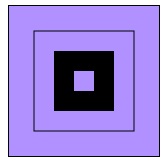

## 基本框架

`Canvas`是一个类似HTML中的img的DOM元素，这个DOM元素除了基本的DOM属性之外，有`width`以及`height`两个属性，这两个属性定义了该元素的高度和宽度。

所有的绘图功能是通过渲染上下文实现的，该DOM元素具有一个`getContext()`方法，这个方法可以获取渲染上下文，这个方法具有一个参数，如果进行2D渲染的话，就传入参数`getContext('2d')`。

### 栅格

Canvas默认的画布被一整个坐标网格覆盖，栅格中的一个单元也就相当于Canvas元素中的一个像素。栅格的起点为左上角，所有元素的位置都是相对于原点的坐标的。

### 绘制矩形

和SVG不同的是，canvas仅仅支持一种原生的图形绘制，也就是矩形。其他图形的绘制都至少需要生成一条路径。

* `fillRect(x, y, width, height)`：绘制一个填充矩形
* `strokeRect(x, y, width, height)`：绘制一个矩形边框
* `clearRect(x, y, width, height)`：清除指定矩形区域，让清除部分完全透明

```
ctx.strokeRect(25, 25, 100, 100)
ctx.fillRect(45, 45, 60, 60)
ctx.clearRect(65, 65, 20, 20)
```


### 绘制路径

图形的基本元素是路径。路径是通过不同颜色和宽度的线段或者曲线相连形成的不同形状的点的集合。一个路径，甚至一个子路径都是闭合的。

1. 首先需要创建路径的起始点(`beginPath()`)
2. 然后使用画图命令去画出路径
3. 之后将路径进行封闭(`closePath()`)
4. 一旦路径生成，就能够通过描边或者填充路径区域来渲染图形(`stroke()`,`fill()`)

```
ctx.beginPath()
ctx.moveTo(75, 55)
ctx.lineTo(95, 95)
ctx.lineTo(55, 95)
ctx.closePath()
ctx.fill()
```

上面的代码可以画出一个三角形，这里面使用了几个方法。

* `moveTo(x, y)`：这个方法类似于在绘画的时候，将笔从一个点移动到另外一个点，但是并不接触纸。这个方法在绘制不连续的路径时，有很大的作用。
* `lineTo(x, y)`：这个方法可以绘制出一个从当前位置到指定坐标的一条直线。这个方法的参数指出了直线的终点。
* `fill()`：这个方法可以对绘制出的路线进行填充，并且在填充的时候会对路径进行自动闭合，也就相当于先调用了一个`closePath()`方法。
* `stroke()`：这个方法对于绘制出的路径进行描边，这个方法不会让路径自动闭合。

#### 圆弧

* `arc(x, y, radius, startAngle, endAngle, anticlockwise)`：画一个以x, y为圆心的以radius为半径的圆弧，从startAngle开始到endAngle结束，生成的过程是按照anticlockwise时钟方向进行的。注意，这里面的Angle使用的是弧度，需要用`(Math.PI / 180) * degrees`来进行角度和弧度的转换。
* `arc(x1, y1, x2, y2, radius)`：根据给定的控制点和半径画一条圆弧，再将两个控制点用直线相连。

整个圆形最左侧的点为`startAngle=0`，绘制圆弧后的路径终点为角度是`360°`的点。

#### 贝塞尔曲线以及二次贝塞尔曲线

* `quadraticCurveTo(cp1x, cp1y, x, y)`：绘制贝塞尔曲线，其中`cp1x`以及`cp1y`分别为控制点的横纵坐标，`x`以及`y`为结束点的坐标。
* `bezierCurveTo(cp1x, cp1y, cp2x, cp2y, x, y)`：绘制二次贝塞尔曲线，`cp1x`、`cp1y`和`cp2x`、`cp2y`分别为两个控制点的横纵坐标，`x`、`y`是结束点的横纵坐标。

贝塞尔曲线其本身在图形处理领域就有着很广泛的应用，二阶贝塞尔曲线通过设置两个控制点来修改曲线的曲率，形成不同的形状的曲线。

#### Path2D

Path2D可以使用将绘画命令缓存下来，可以快速地重复使用。

使用`new Path2D()`可以快速初始化一个Path2D对象，这个初始化函数的参数可以是空白的，也可以是一条路径或者是一个SVG对象。并且`Path2D.addPath()`方法可以将一条路径添加到原来的Path2D对象当中。

### 色彩

canvas用来给绘制内容上色的方法有两个：`fillStyle=color`以及`strokeStyle=color`，分别用来给填充以及路径进行上色。

canvas的着色色彩支持所有符合CSS规范的色彩，所以本身就可以使用`RGBA`这类携带透明度的色彩来进行着色，并且其还支持一个`ctx.globalAlpha`属性，这个属性标记了canvas里面所有位于该属性赋值之后的所有图形的透明度。

### 线型

可以通过一系列属性来设置线的样式。

* `lineWidth = value`：设置线条宽度。
* `lineCap = type`：设置线条末端样式。
* `lineJoin = type`：设定线条与线条间接合处的样式。
* `miterLimit = value`：限制当两条线相交的时候，交接处的最大长度。
* `getLineDash()`：返回一个包含当前虚线样式，长度为非负偶数的数组。
* `setLineDash(segments)`：设置当前虚线的样式。
* `lineDashOffset = value`：设置虚线样式的起始偏移量。

```
for (var i = 0; i < 10; i++) {
  ctx.lineWidth = i + 1
  ctx.beginPath()
  ctx.moveTo(5+i*14, 5)
  ctx.lineTo(5+i*14, 100)
  ctx.stroke()
}
```

上面的代码会产生一组宽度递增的竖线条，针对于宽度为奇数的线条，其渲染结果可能和我们预料的结果不一样。如果将线条中心定位到栅格的网格线上，那么宽度为1的时候，这个线条会往线的两侧各延伸0.5宽度，这时候网格线的左右两格都占了一半，那么，这两格都会用浅色进行渲染，所以得到的结果和预测的结果不同，这时候如果将中心位置便宜0.5宽度，就可以得到正确的结果了。

`lineCap`属性有三种样式，表示线段端点的样式，`butt`表示正常的线段端点，`round`表示线段末端将会添加一个半径为一半线宽的半圆，`square`表示端点出添加了一个高度为一般线宽的矩形。

`lineJoin`的属性决定了两条线段连接处所显示的样子。这个属性也有三种取值，`round`表示相交的地方边角会被磨圆，`bevel`表示两条线段相交的地方的边角会被切平，`miter`表示相交的地方会延长直到边上交于一点，也就是相交出尖角。

`miterLimit`属性设定了外延交点与连接点的最大距离。

#### 虚线

`setLineDash`方法和`lineDashOffset`属性是用来设置虚线样式的。第一个方法接收一个数组，这个数组指定了线段与间隙的交替情况。第二个参数指定了起始偏移量。

### 渐变

canvas也允许使用线性或者径向的渐变来填充或者是描边。通过新建一个`canvasGradient`对象，可以将其值赋值给`fillStyle`和`strokeStyle`属性来实现。

`createLinearGradient(x1, y1, x2, y2)`：这个方法接收四个参数，表示渐变的起点和终点。

`createRadialGradient(x1, y1, r1, x2, y2, r2)`：这个方法接收6个参数，表示渐变起点的坐标和半径，以及渐变终点的坐标和半径。

`gradient.addColorStop(position, color)`：这个方法接收两个参数，其中`position`参数的取值为0.0~1.0之间，表示渐变中颜色的相对位置。`color`是一个有效的CSS颜色值，表示该位置的色彩。

### 图案样式

`createPattern(image, type)`：这个方法接受两个参数，`image`可以是一个图片对象的引用，`type`必须是repeat,repeat-x,repeat-y,no-repeat参数之一，也就是符合CSS中的`background-image`和`background-repeat`两个参数的值。

### 阴影

`shadowOffsetX`、`shadowOffsetY`：用来设定阴影在X或者Y轴的延伸距离，负值表示阴影会向上或者向左延伸，正值则表示会往下或者向右延伸。

`shadowBlur`：用来设置阴影的模糊程度。

`shadowColor`：用来表示阴影的颜色，是标准的CSS的颜色值。

### Canvas填充规则

当使用`fill`进行填充的时候，可以选择两种填充规则，该填充规则根据某处在路径的外面或者里面来决定是否填充，这对于路径相交或者路径嵌套是有效果的。

`nonzero`：默认值，`evenodd`：按奇偶进行填充。