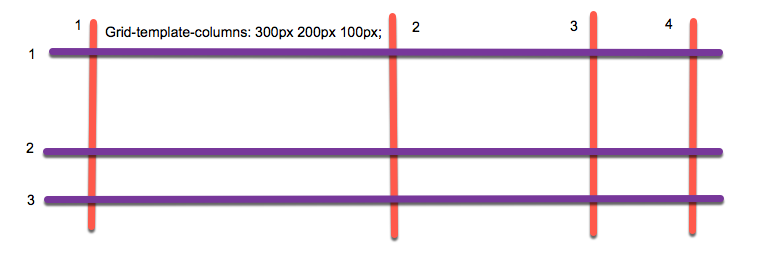

## grid布局

grid布局是网格化布局，但是目前浏览器的支持度比较差，这个布局可以很简单的完成元素的网格化布局。

### 网格线

网格线是grid布局中的一个比较重要的概念，网格线用来在水平和垂直方向分割网格的线。水平网格线从左到右，垂直网格线从上到下排列。



由于网格是一种布局形式，所以需要用`display: grid`来表示，
```
grid-template-columns: 300px 200px 100px;
grid-template-rows: 100px 50px;
```
这个网格被分成了3列2行，三列的宽度依次为`300 200 100`，两行的高度依次为`100 50`，也就是总共分成了6个网格。

### 网格布局属性

如果需要设置网格容器里面项目的位置，则需要使用到网格布局属性。

* `grid-column-start`: 设置网格项目垂直方向的起始网格线。
* `grid-column-end`: 设置网格垂直方向的结束网格线。
* `grid-row-start`: 设置网格水平方向的起始网格线。
* `grid-row-end`: 设置网格水平方向的结束网格线。

通过这些属性，可以定义网格项目放置的区域。定义区域的起始网格线以及结束网格线。这些值的初始值为`auto`，也就是自动寻找网格内的空单元格来进行放置。这些属性还有一种缩写方式：

* `grid-column`: 是`grid-column-start`和`grid-column-end`两个属性的结合缩写，两个值中间使用`1 / 4`进行分隔。

* `grid-row`: 类似于上面，`grid-row-start / grid-row-end`

* `grid-area`: 四个属性的集合，`grid-row-start / grid-column-start / grid-row-end / grid-column-end`

### 单元格跨越(合并单元格)

使用指定网格线的方法可以实现单元格的跨越，也可以使用单元格合并的方式进行单元格的跨越，类似于`table`的`colspan`和`rowspan`属性，使用`span`关键字来实现单元格的跨越。

下面两组代码是等效的：

```
.grid-content:nth-child(5) {
  grid-column: 2 / 4;
  grid-row: 2 / 3;
}
.grid-content:nth-child(5) {
  grid-column: 2 / span 2;
  grid-row: 2 / 3;
}
```

### 负的网格线序号

当网格线序号是负值的时候，其表示的方向与正值的刚好相反，是从右到左，从下到上的。也就是最右边的网格线是-1，最下面的网格线是-1。

网格中的每个元素是有着固定的顺序的，在默认的情况下，每个元素会按照从左到右从上到下依次填充，如果某个元素被设置了固定的位置，那么其他元素仍然会按照顺序依次排列。

### 网格线命名

如果对于网格线的数字表示觉得不清楚，还可以使用命名方式来对网格线进行操作。

```
.grid-container {
  display: grid;
  grid-template-columns: [start] 300px [main] 200px [aside] 100px [end];
  grid-template-rows: [top] 100px [middle] 50px [bottom];
}
```

使用这种命名方式可以直接对网格线进行引用。

并且网格线可以进行重复命名，在重复命名的情况下，可以使用一个正值或者负值来表示选择的是哪个网格线。

```
.item-2 {
  // 表示第二根col网格线
  grid-column: col 2;
}
.item-3 {
  // 表示第一根col网格线到第二根gap网格线
  grid-column: col 1 / gap 2;
}
```

并且`span`不仅仅可以跨越网格数，还可以跨越网格线的名称。

```
.item-2 {
  // 表示从第二条col网格线开始，跨越2条gap网格线
  grid-column: col 2 / span 2 gap;
}
```

### 网格区域

通过之前的`grid-area`可以将某个网格元素，设置其各个边界的网格线。在网格布局当中，还可以直接定义网格区域，用来放置对应的网格项目.

如果将`-start`或者是`-end`作为后缀添加到网格区域名的后面，就会变成4条网格线的隐藏名字，可以使用这个名字来定义网格的大小。

网格区域部分现在支持程度还是比较低，所以最好暂时不要使用。

## flex布局

flex布局是在网格布局出来之前，对网页进行快速布局的一种方案，目前浏览器的支持程度比较高。

flex布局也就是弹性布局，任何一个容器都可以被指定为flex布局。如果是行内元素的话，需要使用`display: inline-flex;`。flex布局会导致子元素的`vertical-align`,`clear`,`float`等属性失效。

### 基本概念

采用了flex布局的元素，被称为flex容器，所有的子元素都是容器成员。

容器默认存在两根轴，分别是水平的主轴和垂直的交叉轴。主轴的开始位置叫做`main start`，结束位置叫做`main end`；交叉轴的开始位置叫做`cross start`，结束位置叫做`cross end`。项目默认沿着主轴进行排列。单个项目占据的主轴空间叫做`main size`，占据的交叉轴空间叫做`cross size`。

### 容器的属性

容器上可以设置6个属性：

#### flex-direction

这个属性决定了主轴的方向，也就是项目的排列方向，有四种情况，分别为水平，反向水平，垂直，反向垂直。

```
.box {
  // 水平 | 右端起点水平 | 垂直 | 下端起点垂直
  flex-direction: row | row-reverse | column | column-reverse;
}
```

#### flex-wrap

这个属性定义了项目排在一个轴线上的时候，一条轴线排不下的处理情况，如何进行换行。

```
.box {
  // 不换行 | 换行 | 反向换行
  flex-wrap: nowrap | wrap | wrap-reverse
}
```

#### flex-flow

`flex-flow`属性是上面两个`flex-direction`和`flex-wrap`属性的简写形式，也就是两个形式的合二为一。

#### justify-content、align-items

`justify-content`属性定义了项目在主轴上的对其方式，而`align-items`属性定义了项目在交叉轴上的定义方式。

```
.box {
  // 左对齐 | 右对齐 | 居中 | 两端对齐 | 每个项目两侧的gap相等
  justify-content: flex-start | flex-end | center | space-between | space-around;
  // 上对齐 | 下对齐 | 居中 | 第一行文字的文本基线对齐 | 拉伸，占满容器
  align-items: flex-start | flex-end | center | baseline | stretch;
}
```

#### align-content

`align-content`属性定义了多根轴线的时候的对其方式，如果只有一根轴线则不起作用。

```
.box {
  // 与交叉轴起点对齐 | 与交叉轴终点对齐 | 居中 | 与交叉轴两端对齐 | 每根轴线两侧间隔相等 | 占满整个交叉轴，拉伸
  align-content: flex-start | flex-end | center | space-between | space-around | stretch;
}
```

### 项目的属性

也有6个可以设置在项目上的属性：

#### order

`order`属性定义项目的排列顺序，数值越小，排列的越靠前，默认为0，也就是这个属性可以打乱其原本在文档流中的位置。

#### flex-grow属性

`flex-grow`属性定义项目的放大比例，默认值为0，也就是即使存在剩余空间，也不进行放大。如果所有项目的该属性值都为1，那么他们将等分剩余空间，否则，定义为2的元素将占据比别人多一倍的剩余空间。

#### flex-shrink属性

`flex-shrink`属性定义了项目的缩小比例，如果空间不足，该项目将会被缩小。如果其属性值为0，那么在空间不足的时候，值为0的元素将不会被缩小。

#### flex-basis

`flex-basis`属性定义了在分配多余的空间之前，项目占据的主轴空间。浏览器根据这个属性，计算主轴是否有多余的空间。这个属性也可以使用固定的值，那么这个项目就会占据固定长度的空间。

#### flex

`flex`属性是上面三个属性：`flex-grow`,`flex-shrink`,`flex-basis`的组合，默认情况下其值为：0 1 auto

#### align-self

`align-self`属性允许单个项目有与其他项目不一样的对齐方式，可以对`align-items`属性，默认值为auto。