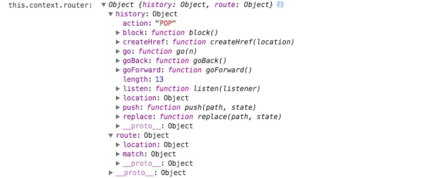

## React Context in React v15.5

在React中，可以很容易地将数据流通过组件进行传递，在某些情况下，可能需要不手动的情况下将`props`自动逐层发送，这里需要用到`context API`。

### Why Not To Use Context

在大多数情况下是不需要使用上下文的。

很多情况下都可以使用`state`，`props`或者Redux进行状态的传递，并不需要使用这个不稳定的接口。

### 使用上下文

```
const PropsTypes = require('prop-types')

class Button extends React.Component {
  // 从树的上下文中获取color属性，通过this.context进行访问
  contextTypes = {
    color: PropTypes.string
  }
  render() {
    return (
      <div> {this.context.color} </div>
    )
  }
}
// some component code

class MessageList extends React.Component {
  getChildContext() {
    return {color: 'purple'}
  }
  childContextTypes = {
    color: PropTypes.string
  }
}
```

组件树上层组件的`getChildContext`方法和`childContextTypes`属性将上下文信息自动传递到子树的所有组件上面，然后再子组件中通过定义`contextTypes`来进行组件的访问。如子树没有定义该属性，那么`this.context`将是一个空对象。

上下文的这个功能可以用于相隔的祖先和后代组件之间的通信。并且后代组件可以和祖先组件进行反向通信。

## React.Children

在代码中引入React的时候，除了经常使用的`React.Component`来构建组件之外，还有`React.Children`对象，这个对象具有一些API，可以用来直接对`this.props.children`进行操作。

1. `React.Children.map`：遍历每一个子组件，并且调用回调函数。并且返回一个操作过后的数组。
2. `React.Children.forEach`：类似于上面的方法，不过这个方法不直接返回一个数组。
3. `React.Children.count`：用来获取子组件的个数。
4. `React.Children.only`：用来返回唯一的一个子组件，如果不是唯一的子组件，则抛出异常。
5. `React.Children.toArray`：获取子组件的一个平面数组，可以对每一个元素进行重新操作，这个方法对于需要对子组件进行重新排序或者分块是很有用的。

## Route

`Route`组件依赖了从父组件传递来的上下文中的`this.context.router`对象，这个对象中包含：



计算路由匹配结果的代码：

```
computeMatch({ computedMatch, location, path, strict, exact }, {route}) {
  // 父组件路由计算结果存在的话，就直接返回
  if (computedMatch) {
    return computedMatch
  }
  // 从上下文或者参数中获取路径信息
  const pathname = (location || route.location).pathname
  // 返回路由匹配的结果
  return path ? matchPath(pathname, { path, strict, exact }) : route.path
}
```

返回的对象的会被写入到`Route`组件的状态里面，路由匹配的对象看起来是这样的，这里面包含了是否完全匹配，参数，路径等信息，如果路由匹配失败，那么这个对象就是`null`：


在React Router 4中，所有的路由都被组件化了，也就是路由的行为和组件是一致的，在组件的`componentWillMount`生命时段，执行一次组件的路由匹配，该路由匹配可以判断在组件第一次加载的时候，是否需要渲染这个组件，并且在组件接收到新的属性的时候，该路由匹配也会进行一次新的匹配，来决定渲染效果：

```
render() {
  return (
    component ? (
      match ? React.createElement(component, props) : null
    ) : render ? (
      match ? render(props) : null
    ) : children ? (
      typeof children === 'function' ? (
        children(props)
      ) : !Array.isArray(children) || children.length ? (
        React.Children.only(children)
      ) : (
        null
      )
    ) : (
      null
    )
  )
}
```

如果`match`组件匹配成功，就直接根据`props`来进行渲染，否则直接渲染`null`进去。在组件上下文发生了改变的时候，也会触发一次重新渲染，当路由发生变化，`history`对象会发生相应的变化，引起组件的`re-render`。

## Link

React Router4里面调用了许多HTML5的API，HTML5本身原生提供了许多对于路由信息的处理函数以及方法。

其使用了对于HTML原生history的一个封装库：[history库](https://github.com/ReactTraining/history "history库")

使用`import createHistory from 'history/createBrowserHistory'`来引入模块，初始化模块之后就可以调用模块的方法和属性了，这些属性和方法基本上都是和路由以及导航相关的。使用`push,replace,go`方法可以进行路由的跳转，具体可以见该库的github。

针对点击事件的处理会优先使用行内的`onClick`函数，如果函数不存在的话，才会使用默认的URL跳转。

```
handleClick = (event) => {
  if (this.props.onClick)
    this.props.onClick(event)
  /**
    * 进行几种判断处理
    * 1. 是否已经被移除了默认操作，已经移除默认操作的不进行处理
    * 2. 是否为右键点击，对于右键点击不进行处理
    * 3. 是否目标为空，目标为空的不进行处理
    * 4. 是否已经按住辅助按键，已经按住辅助按键的不进行处理
    */
  if (
    !event.defaultPrevented &&
    event.button === 0 &&
    !this.props.target &&
    !isModifiedEvent(event)
  ) {
    event.preventDefault()

    const { history } = this.context.router
    const { replace, to } = this.props

    if (replace) {
      history.replace(to)
    } else {
      history.push(to)
    }
  }
}
```

## hashRouter

HashRouter可以让一组路由变成哈希路由，也就是在该路由URL的前面会缀上`#`号，保证浏览器在加载这个路由内部代码的时候，只进行浏览器端交互，而不向服务器请求数据，这个`#`在HTML中叫做锚点，是用来跳转到页面的某个部分的。浏览器在发送HTTP请求的时候，关于`#`号后面的内容是不会被发送到服务器的。但是这个哈希值却会被浏览器的历史记录记录下来，保证了浏览器的前进和后退等操作可以正常使用。

该组件和一般的`BrowserRouter`的差别仅仅在于其调用的history函数库的时候，使用的是`createHashHistory`方法。