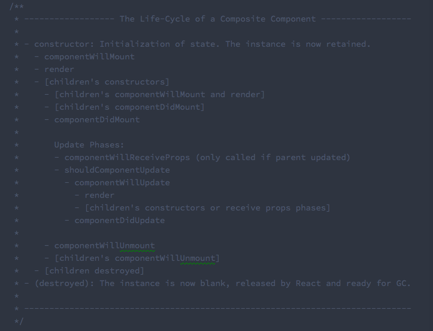
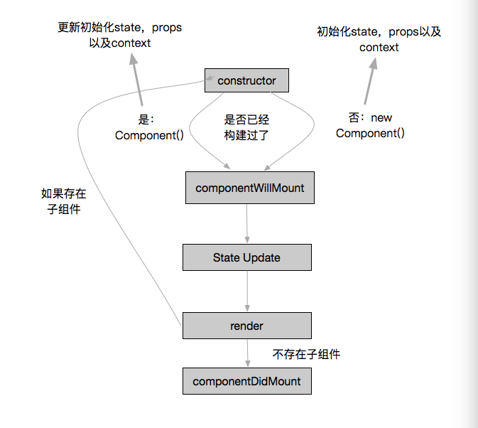

## ReactCompositeComponent

自定义组件(ReactCompositeComponent)的声明周期主要通过三个状态进行管理：*MOUNTING*、*RECEIVE_PROPS*、*UNMOUNTING*，它们负责通知组件当前所处的状态。每个状态对应一个方法：`mountComponent`,`updateComponent`,`unmountComponent`，每个方法都提供了两个处理方法，一个是`will`，在进入该状态之前调用，另外一个是`did`，在进入状态之后调用。

React源代码中，对于组件的生命周期，有一个字符图片:



### mountComponent

在挂载组件的时候，首先是对于组件的初始化，也就是`constructor`方法的过程：



#### constructor

组件的初始化，首先需要对上下文和属性进行处理：要将`contextTypes`对应的上下文分离出来，在组件初始化之前，需要首先获取组件`contextTypes`对应的上下文内容，传入的`props`内容以及是否应该对于组件调用构造函数。对于上下文的处理主要是通过`this._processContext()`方法进行实现的。通过传入到`ReactCompositeComponent`构造器中的`element`的参数进行判断，判断组件是否需要重新构造，也就是判断传入的元素是否已经是一个React组件了，如果不是一个React组件才进行构造。

所以每个React自定义组件都仅仅会在第一次被挂载的时候进行一次初始化，在这次初始化的时候，会获得公共的上下文以及公共的属性。并且在组件状态或者上下文改变的时候，虽然会进行组件的重新渲染，但是这时候组件已经存在，就不再进行初始化了。

```
/**
 *  如果该组件原本不存在的话，则构建一个新的组件，否则更新原组件的上下文
 *	以及属性信息，并且返回一个组件实例。这是针对有状态的组件进行处理的
 */
_constructComponentWithoutOwner: function(
	doConstruct,
	publicProps,
	publicContext,
	updateQueue
) {
	var Component = this._currentElement.type
	if (doConstruct) {
		if (__DEV__) {
			// 在需要进行构造处理的时候，创建一个新的组件，
			// 并且在开发环境下评估其性能，measureLifeCyclePerf方法的
			// 第三个参数`ctor`表示是进行构造
			return measureLifeCyclePerf(
				() => new Component(publicProps, publicContext, updateQueue),
				this._debugID,
				'ctor',
			)
		} else {
			return new Component(publicProps, publicContext, updateQueue)
		}
	}
	...
		return Component(publicProps, publicContext, updateQueue)
}
/**
	* 针对无状态的函数式组件，需要使用另外的处理逻辑，也是组件的创建逻辑，使用
	* new StatelessComponent(Component)
	* 构造函数来进行构造。
	*/
```

这时候对组件的状态进行初始化：

```
// 保证在无状态初始化的时候，状态是null而不是undefined
var initialState = inst.state
if (initialState === undefined) {
	inst.state = (initialState = null)
}
```

#### 组件挂载的其他周期

然后检测，是不是存在`componentWillMount`方法，如果存在的话就执行这个方法。当正在挂载的时候，在`componentWillMount`函数中调用`setState`将会设置`this._pendingStateQueue`，并不进行重新渲染，而是通过`this._processPendingState`方法计算出一个新的状态，并且保存在实例的`inst.state`属性上面。并且在进行状态队列合并的时候，*不会发生组件的重新渲染，这样可以防止出现死循环*。并且这个更新后的状态就可以在`render`函数中获取，所以在`componentWillMount`函数中进行的任何状态的操作都会直接影响到渲染的结果。

下一步进行渲染，也就是执行`inst.render()`方法，React的渲染是递归进行的，也就是父组件执行到渲染函数的时候，其子组件会挨个被进行组件的构建过程，直到运行到子组件的渲染函数，这个时候如果依然有子组件，那么会继续递归，否则执行完子组件的状态方法，会将控制权交还给父组件。

之后与进行`componentWillMount`类似，这里进行`componentDidMount`，并且在执行完毕之后，移除`willMount`期间的回调函数，最后返回渲染完毕的内容。结束整个`mountComponent`周期。

### unmountComponent

这个方法主要实现组件被卸载时候的清理机制，目前在源代码中可以看到这个方法进行两段处理，第一段是`componentWillUnMount`，第二段是`unmountComponent`。

主要的清理工作：

```
if (inst.componentWillUnmount && !inst._calledComponentWillUnmount) {
	// 标记处理工作已经开始
	inst._calledComponentWillUnmount = true
	....
	// 调用设定的componentWillUnMount方法
	inst.componentWillUnmount()
}
// 如果被渲染的组件内容存在，那么针对所有的子组件也进行
// 迭代处理，全部进行清理工作
if (this._renderedComponent) {
	ReactReconciler.unmountComponent(
		this._renderedComponent,
		safely,
		skipLifecycle
	)
	// 清理全部的和子组件有关的内容
	this._renderNodeType = null
	this._renderedComponent = null
	this._instance = null
}
// 重置所有的挂起域，即使这个组件还计划进行一次更新操作
// 这个更新操作仍然会被忽略，因为这个域被重置了
this._pendingStateQueue = null
this._pendingReplaceState = false
this._pendingForceUpdate = false
this._pendingCallbacks = null
this._pendingElement = null

// 下面的这几个内容，在一般情况下可以不进行清理
// 除非是这个组件以后再也不会访问了
this._context = null
this._rootNodeID = 0
this._topLevelWrapper = null

// 从内部实例容器中删除这个组件的实例的引用
ReactInstanceMap.remove(inst)
```

### updateComponent

#### componentWillReceiveProps

在进行组件状态更新的时候，首先对于上下文的状态进行判断：

```
// 是否进行更新、下一次更新时候的上下文
var willReceive = false
var nextContext

// 判断当前的完整上下文和传入的没有经过截取的上下文有没有
// 区别，如果没有区别，则不需要进行更新
if (this._context === nextUnmaskedContext) {
	nextContext = inst.context
} else {
// 如果有区别，那么首先要对下一级上下文进行截断操作
// 然后将确认更新组件的标识置为true
	nextContext = this._processContext(nextUnmaskedContext)
	willReceive = true
}

// 如果父元素发生了变化，那么也进行组件的更新
if (prevParentElement !== nextParentElement) {
	willReceive = true
}

// 在内部确定需要更新的时候，才会调用外部的
// componentWillReceiveProps方法
if (willReceive && inst.componentWillReceiveProps) {
	const beforeState = inst.state
	inst.componentWillReceiveProps(nextProps, nextContext)
	const afterState = inst.state
	// 判断该函数调用之后，状态是否发生了改变，如果发生了改变
	// 则需要先恢复状态，然后将新的状态置入队列中
	if (beforeState !== afterState) {
		inst.state = beforeState
		inst.updater.enqueueReplaceState(inst, afterState)
	}
}
```

从上面的代码中可以看到，组件内部针对于组件是否更新的判断来自于两个信息，首先是传入到组件的上下文是不是发生了变化，其次是该组件的父组件是否发生了变化，如果这两个信息发生了变化，那么组件就会调用`componentWillReceiveProps`方法，否则连这个方法都不会调用。而如果在这个方法中修改了组件的状态，那么组件的状态不会立即更新，而是将更新信息放到队列中，等待判断`shouldUpdate`才更新。

#### shouldComponentUpdate

这个阶段主要判断组件是否进行更新，在不存在`shouldComponentUpdate`函数可以调用的情况下，组件是否更新判断的标识主要有两个，当前状态和下一个状态，当前组件得到的属性和上一个属性，该次比较是浅比较。如果存在这个函数的话，更新操作*完全不依赖状态和属性，仅仅根据这个函数得到的结果*。所以在代码中，尽量使用这个函数来保证组件得到正确更新，这样可以防止许多不必须的组件reRender，在一定程度上提升性能。

在这个阶段之后，组件会进行正常的挂载操作，也就是`componentWillUpdate`、`render`以及`componentDidUpdate`三个操作。

```
// 进行状态的更新操作
var nextState = this._processPendingState(nextProps, nextContext)
var shouldUpdate = true

if (!this._pendingForceUpdate) {
	// 初始化上一次的状态，进行状态比较，通过状态比较以及之前willReceive操作
	// 来对是否更新进行判断
	var prevState = inst.state
	shouldUpdate = willReceive || nextState !== prevState
	if (inst.shouldComponentUpdate) {
		// 这个地方得到的shouldUpdate会覆盖之前的操作结果，所以
		// 可以保证完全手动控制更新操作的reRender
		shouldUpdate = inst.shouldComponentUpdate(nextProps, nextState, nextContext)
	} else {
		shouldUpdate = !shallowEqual(prevProps, nextProps)
			|| !shallowEqual(inst.state, nextState)
	}
}
```

### 状态更新

实现React组件状态更新的操作主要来自于一个`_processPendingState`函数，而这个状态是和上一次的状态进行合并还是替换掉前一次的状态，取决于一个属性：`this_pendingReplaceState`，这个函数会在提取完`this._pendingReplaceState`以及`this._pendingStateQueue`这两个属性的值后，将其重置。

```
// 当前要更新的状态队列为空，则不进行状态更新，直接返回原状态
if (!queue) {
	return inst.state
}
// 如果是选择了替换模式，并且队列为1，那么可以直接返回队列的第一个状态
if (replace && queue.length === 1) {
	return queue[0]
}
// 初始化下一个状态，替换模式为队列的第一个元素，合并模式为原状态
var nextState = replace ? queue[0] : inst.state
for (var i = replace ? 1 : 0; i < queue.length; i++) {
	// 进行状态合并
}
return nextState
```
